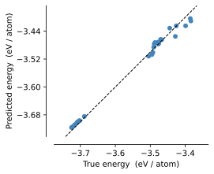

.. toctree::
   :maxdepth: 4
   :hidden:
   :caption: Contents:

   Home <self>
   models
   data
   training
   analysis
   examples

################################
:code:`graph-pes` Documentation
################################

:code:`graph-pes` is a framework for building, training and analysing potential energy surface (PES) models that act on
graph representations of atomic structures.

Quickstart
==========

Install ``graph-pes`` from PyPI (we reccomend doing this in a new environment via e.g. ``conda create -n graph-pes python=3.10 -y``)

.. code-block:: bash

    pip install graph-pes

Train a model
-------------

Point ``graph-pes`` to the model architecture you want to create, the data you want to train on, the loss function you want to use and any other training hyperparameters you care about:

.. literalinclude:: quickstart-config.yaml
    :language: yaml

and then run ``graph-pes-train --config config.yaml``. For more info see [TODO].

:code:`graph-pes` aims to provide sensible defaults to allow for getting started quickly:

.. literalinclude:: quickstart.py
    :language: python

For a more detailed introduction, see an example notebook `here <notebooks/example.html>`_. 
For under-the-hood details see :func:`train_model() <graph_pes.training.train_model>`.

